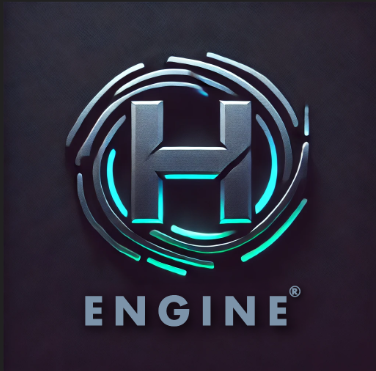

  
  

    <h1 style="margin: 0;"><b>H ENGINE</b></h1>
  

## DISEÑO Y ARQUITECTURA

> Se trata de un motor ECS basado en la carga de entidades y componentes a partir de archivos LUA.
> Además, cuenta con un editor en el que se pueden modificar valores de componentes y guardarlos en la escena.

### ESTRUCTURA DE LA SOLUCIÓN Y PROYECTOS (REPOSITORIOS DE GIT)
> - **Dependencies**: Código fuente de las dependencias del motor y sus compilaciones.  
>
> - **Build**: Contiene ejecutables del motor en Debug y Release y las correspondientes DLLs. También incluye un archivo *logs.txt* donde se puede mirar la salida del motor como excepciones o debugs.  
>
> - **Src**: Código fuente del motor. Están subdivididos por módulos del motor y una carpeta *include* que contiene los *headers* de todo el motor.  
>
> - **Project**: Contiene las configuraciones de los proyectos de Visual Studio y la solución del motor.  
>
> - **Tmp**: Archivos temporales (.obj, ...).  
>
> - **Libs**: Bibliotecas generadas de cada módulo del motor.  
>
> - **Assets**: carpeta base necesaria para hacer los juegos.  
>
>   - **Fonts** : se almacena los .ttf y un archivo .fontdef donde están definidas las distintas fuentes.
>   - **Images** : aqui están los .png que son utilizados para el juego.
>   - **Materials** : aqui están los archivos .material que son empleados por Ogre y los .png que son utilizados como texturas para los materiales.
>   - **Mesh** : aqui las mallas .mesh, que definen las mallas y sus animaciones asociadas a la malla.
>   - **ScriptsLua** : aqui hay varios archivos .lua. El primero es utils.lua, que contiene funciones en LUA para el manejo de datos para las entidades y componentes. Por otra parte esta el script MapExporter.lua, que se encarga de pasar de un archivo .lua donde se ha cargado un .blend todas las entidades y meter estas  a una escena con los componentes correspondientes. Además, aqui se localizan todas las escenas que se usan en los juegos. 
>   - **Skeleton** : se guardan los .skeleton para las animaciones.
>   - **Sounds** : se almacenan los sonidos (.mp3, .wav).
>
> - **Resources**: (para los juegos): .blend para la carga de mapas. Además, hay un archivo BlenderAuto.bat, que te pasa los .blend a escenas .lua de forma automatica.

## MÓDULOS Y CLASES
> Todos los sistemas/módulos del motor cuentan con interfaces para poder ser utilizadas desde los juegos.
>
> - **Engine** : bucle principal del juego y carga de .dll del juego.
>   - **Transform** : componente transform, tanto global como local.
>     
> - **Editor**: Se encarga de la gestion del editor. Tanto renderizado del editor como los datos que maneja (entidades).
>   - **EditorSystem**: como tal se encarga de renderizar la interfaz del editor. Aqui se muestra la escena que está cargada, la lista de entidades con sus componentes, podiendo modificar sus datos y guardarlos en la escena. También cuenta con un gizmos para mover, rotar y escalar entidades.
>   - **ImguiManager** : encargado de gestionar ImGUI sirviendo de puente con Ogre3D.
> 
> - **ECS**: Base del Entity/Component/System junto con el Manager encargado de gestionar estos elementos.
>   - **Entity** : definición de una entidad, contiene una lista de los componentes que tiene, una referencia a su padre y a sus hijos.
>   - **Component** : clase abstracta para poder crear componentes con disita información.
>   - **System** : clase abstracta para poder crear sistemas con distina logica y funciones.
>   - **Manager** : encargado de incializaar, gestionar y limpiar las entidades, sistemas, componentes y mensajes.
>   - **ecs** : aqui se definen los componentes, sistemas, handlers y mensajes del motor.
> 
> - **Utils** : 
>    - **LoadLua** : puente entre datos de archivos .lua y el motor. Carga y guardado de escenas.
>    - **DebugLog** : sirve para lanzar mensajes a un log.txt situado en la carpeta del .exe.
>    - **Vector3**
>    - **Vector2**
>    - **Quaternion**
>    - **Color**
>    - **CheckML** : herramienta para los memory leaks.
>      
> - **Input - [SDL]**
>   - **InputSystem** : procesa la entrada en el motor (Teclas, ratón y mando).
>   - **InputKeys** : definiciones de teclas, botones del raton y controles de mando con nombre propio para nuestro motor.
> 
> - **Audio - [Fmod]** 
>   - **AudioSystem** :  Reproduce y gestiona los sonidos.
>   - **AudioListener** : datos de la posición de escucha.
>   - **AudioSource** : datos de posición de emisión.
>  
> - **GUI - [ImGUI]**
>   - **UISystem** :  Gestiona diferentes elementos de la interfaz.
>   - **UIElement** : clase abstracta para los elementos de la interfaz.
>   - **ButtonComponent**
>   - **Canvas**
>   - **InputField**
>   - **UIImageComponent**
>   - **UISliderComponent**
>   - **UITextComponent**
>     
> - **Render - [Ogre3D]**: Gestion de mallas, texturas, animaciones, particulas, materiales y luces.
>   - **AnimationSystem** : gestion de animaciones.
>   - **ParticleSystem** : gestion de las particulas.
>   - **RenderSystem** : gestion de mallas, transform, luces, cámara y renderizado general.
>   - **AnimationComponent**
>   - **CameraComponent**
>   - **Light**
>   - **RenderMesh**
>   - **RenderParticle**
>     
> - **Physics - [Nvidia:Physx]** : Simulación física, gestión de colisiones y materiales fisicos.
>   - **PhysicsSystem** : creación de componentes físicos(RigidBody, Colliders...), simulación física y coordinación con Transform. Además, tiene implementación para materiales físicos y raycast (filtro mediante handlers).
>   - **CollisionManager** : gestion de colisiones. Colliders y triggers.
>   - **RigidBody** : estático, cinemático y dinámico.
>   - **Collider** : clase abstracta para distintos tipos de collider.
>   - **BoxCollider**
>   - **SphereCollider**
>   - **CapsuleCollider**

## INSTRUCCIONES DE COMPILACIÓN DE JUEGOS
> Para poder ejecutar la compilación automática de los juegos, es necesario clonar los repositorios de dichos juegos (NOTA: Es necesario que los nombres de los directorios de la ubicación donde se clonen los repositorios de los juegos no contengan espacios para que la compilación automática funcione sin problemas) y ejecutar, mediante la consola de Visual Studio, el archivo ".bat" llamado "compilacion_automatica.bat", añadiendo como parámetro el modo de configuración que se quiera compilar, "debug" o "release" (NOTA: No compilar las dos configuraciones a la vez en dos consolas distintas, si se quieren las dos configuraciones compile una y espere a que termine para compilar la otra). Este archivo accede al motor mediante el submódulo que tiene agregado el repositorio, el cuál realiza los siguientes pasos:
> - Paso 1: Llamar al bat que compila el motor.
> - Paso 2: Copiar la carpeta "build" al directorio del juego.
> - Paso 3: Ejecutar el compilacion_automatica.bat asociado a cada juego para compilarlo en la configuración que se le ha indicado.
> - Paso 4: Crear carpetas para poder ejecutar el juego en Debug y en Release.

> Para ejecutar el juego una vez se haya realizado la compilación hay que pulsar el Main.exe de la carpeta [NOMBRE_JUEGO]Release. El Main.exe de la carpeta [NOMBRE_JUEGO]Debug ejecuta el editor del motor con los elementos del juego cargados, y desde ahí también se puede ejecutar el juego dándole al botón de play.

## FUNCIONAMIENTO DE EXPORTACIÓN E IMPORTACIÓN DE MALLAS
> Para poder exportar diferentes objetos a nuestros juegos hay que seguir los siguientes pasos:
> - Añadir en Blender el Add-on de **[blender2ogre](https://github.com/OGRECave/blender2ogre)** y seguir los pasos del repositorio de la descarga para una buena instalación.
> - Añadir a la escena de Blender los assets a exportar, usar .gltf 0 .glb (recomendación)
> - Ir a la opción de exportar y elegir la opción de Ogre3D (.scene and .mesh)
> - Configurar la exportación según los requisitos que el usuario quiera.
> Para poder importarlo al juego y probarlo deberás hacer lo siguiente:
> - Ir a la carpeta donde has realizado la exportación.
> - Mover los archivos necesarios a sus respectivas carpetas de "Assets" del juego. Por ejemplo, se creara un .mesh que ira a la carpeta "Mesh", un .material a "Material" (si tiene agregada una textura se exportará también y se deberá incluir en la misma carpeta), y > para los que tienen animación un .skeleton que ira a la carpeta "Skeleton".
> - Ya solo falta configurarlo en el juego y a disfrutar.
> 
## FUNCIONAMIENTO DE IMPORTACIÓN DE .BLENDS EN NUESTROS MOTOR
> Hemos implementado a **H Engine** la opción de poder importar directamente .blend y que el motor se encargue de crear un .lua para que cuando el usuario quiera pueda importarlo a la escena. Para conseguirlo, el juego deberá contar con una carpeta de "Resources", > donde incluirá los archivos .blend. Cuando el usuario vaya a compilar el juego, se hará una precompilación de "Resources" y verá si los .blend ya han sido convertidos a .lua, si son archivos nuevos hará esta conversión con la ayuda de Blender, ya que ejecutará un código de python permitiendo esta conversion. Con esto conseguiremos tener un .lua con toda la información del .blend. Es importante recarlcar que para lograr la importación en la escena, se debe tener las mallas y sus respectivos materiales en la carpeta de "Assets". Por último, para importarlo a la escena basta con ejecutar un metodo de nuestra clase "LoadLua" que se llama loadMapInScene con la ruta al archivo a importar y la ruta a la escena a donde lo quieres importar. 

<h2 align="center"><b> NineandoCorp</b></h2>

    

  
  

  
 

